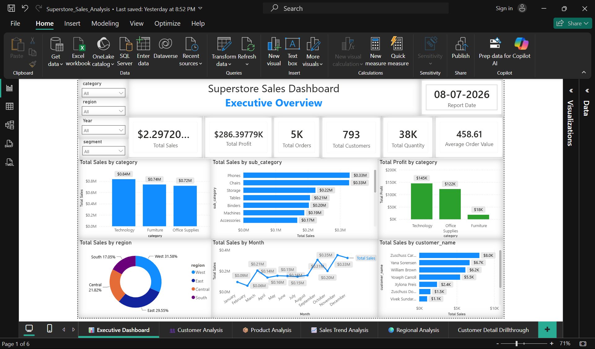
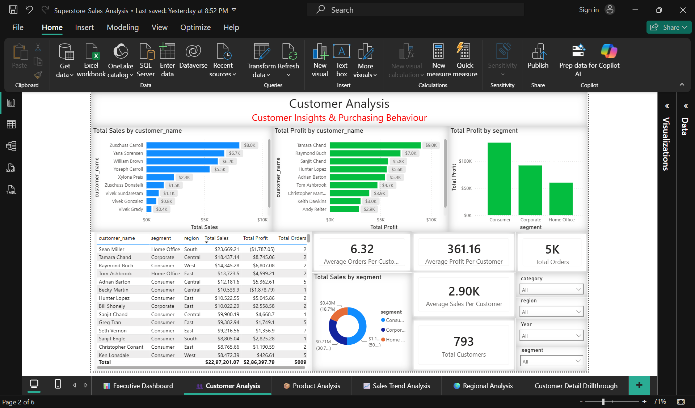
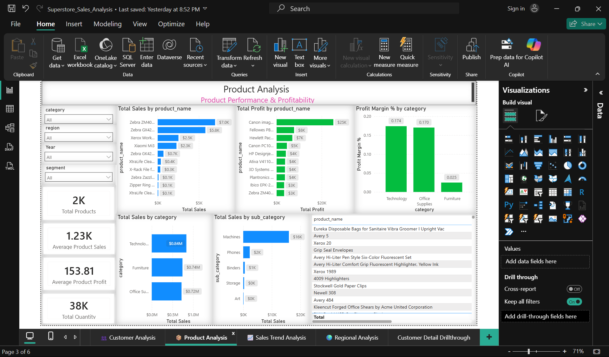
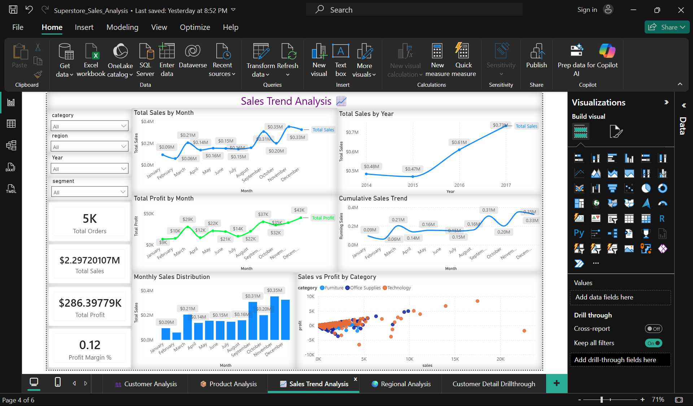
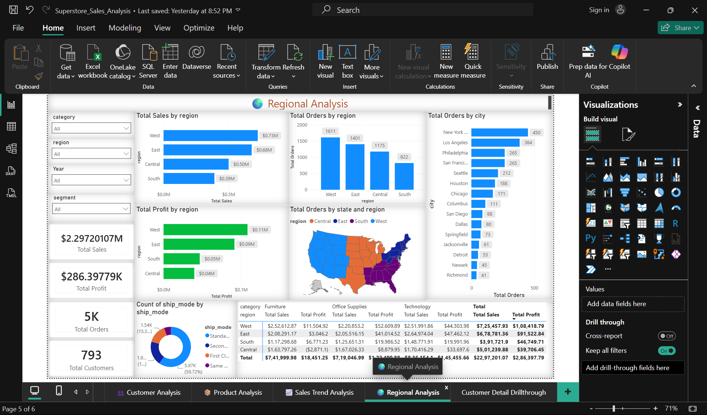
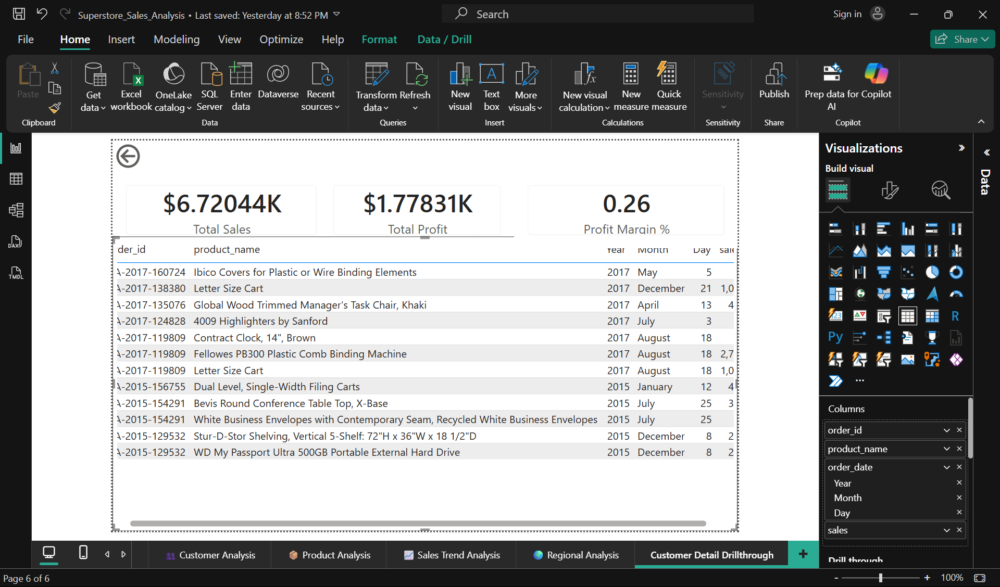
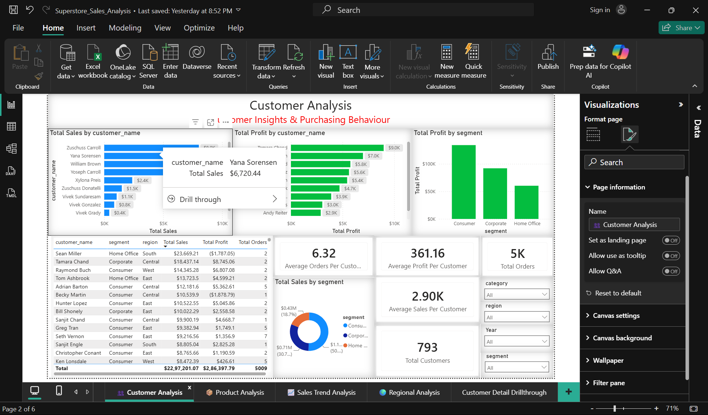
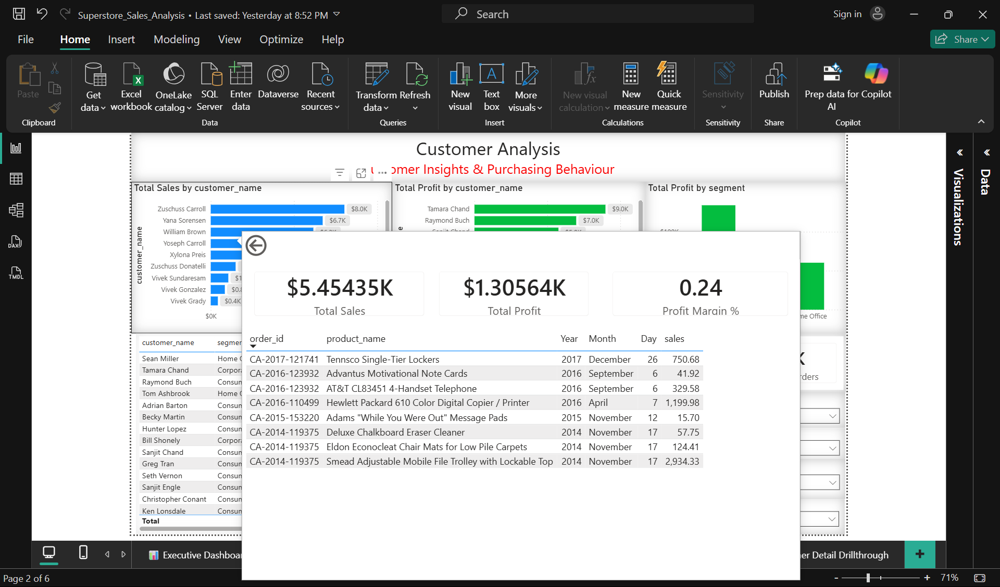
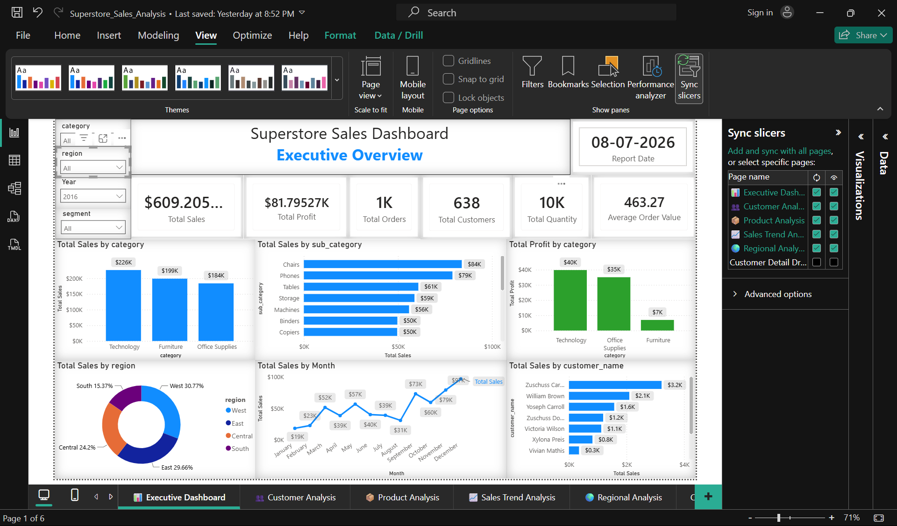

# 📊 Superstore Sales Analysis

An end-to-end **Data Analytics** project that analyzes retail sales performance, customer behavior, product profitability, regional performance, and sales trends using **PostgreSQL, SQL, Power BI, DAX, Power Query, and Excel**.

This project demonstrates a complete analytics workflow—from raw data preparation to SQL analysis and interactive business intelligence dashboards.

---

# 🚀 Project Overview

This project follows a real-world Business Intelligence workflow:

**Raw Dataset → Data Cleaning → PostgreSQL → SQL Analysis → Power BI Dashboard**

The dashboard answers important business questions such as:

- Which product categories generate the highest sales and profit?
- Who are the top-performing customers?
- Which regions contribute the most revenue?
- How do sales and profits change over time?
- Which products have the highest profitability?

---

# 🛠 Tech Stack

- PostgreSQL
- SQL
- Power BI
- DAX
- Power Query
- Microsoft Excel

---

# 📂 Dataset

### Source

The original dataset was downloaded from Kaggle.

**Dataset:** https://www.kaggle.com/datasets/vivek468/superstore-dataset-final

### Dataset Files

| File | Description |
|------|-------------|
| Sample-Superstore-Raw.csv | Original dataset downloaded from Kaggle |
| Sample-Superstore-PostgreSQL.csv | Cleaned dataset prepared for PostgreSQL import and SQL analysis |

### Dataset Summary

| Attribute | Value |
|-----------|-------|
| Total Records | 9,994 |
| Total Columns | 21 |
| Categories | 3 |
| Sub-Categories | 17 |
| Customer Segments | 3 |
| Regions | 4 |
| Time Period | 2014–2017 |

### Key Fields

| Category | Columns |
|----------|---------|
| Order Information | Order ID, Order Date, Ship Date, Ship Mode |
| Customer Information | Customer ID, Customer Name, Segment |
| Location Information | Country, City, State, Postal Code, Region |
| Product Information | Product ID, Product Name, Category, Sub-Category |
| Business Metrics | Sales, Quantity, Discount, Profit |

---

# 📁 Repository Structure

```text
Superstore-Sales-Analysis/
│
├── dataset/
│   ├── Sample-Superstore-Raw.csv
│   └── Sample-Superstore-PostgreSQL.csv
│
├── sql/
│   ├── 01_sales_analysis.sql
│   ├── 02_customer_analysis.sql
│   ├── 03_product_analysis.sql
│   ├── 04_advanced_sql.sql
│   ├── 05_regional_analysis.sql
│   ├── 06_inventory_analysis.sql
│   ├── 07_time_analysis.sql
│   └── 08_customer_metrics.sql
│
├── sql_outputs/
│   ├── sales/
│   ├── customer_analysis/
│   ├── customer_metrics/
│   ├── product/
│   ├── regional/
│   ├── inventory/
│   ├── time/
│   └── advanced/
│
├── dashboard/
│   └── Superstore_Dashboard.pbix
│
├── screenshots/
│
├── README.md
├── LICENSE
└── .gitignore
```

---

# 📊 Dashboard Pages

### Executive Dashboard

- Executive KPI Overview
- Category-wise Sales
- Monthly Sales Trend
- Regional Sales
- Top Customers

### Customer Analysis

- Customer Sales Analysis
- Customer Profit Analysis
- Segment-wise Analysis
- Customer KPIs
- Customer Drillthrough

### Product Analysis

- Product Performance
- Category Analysis
- Sub-category Analysis
- Profit Margin Analysis

### Sales Trend Analysis

- Monthly Sales Trend
- Monthly Profit Trend
- Running Sales
- Sales Distribution
- Sales vs Profit

### Regional Analysis

- Regional Sales
- Regional Profit
- City-wise Analysis
- Ship Mode Distribution
- Geographic Map

### Customer Detail Drillthrough

Provides detailed transaction-level information for any selected customer.

---

# 📈 KPIs

- Total Sales
- Total Profit
- Total Orders
- Total Customers
- Total Products
- Total Quantity
- Average Order Value
- Average Sales Per Customer
- Average Profit Per Customer
- Average Orders Per Customer
- Average Product Sales
- Average Product Profit
- Average Discount
- Running Sales
- Profit Margin %
- Report Date

---

# 🚀 Features

- Executive Dashboard
- Customer Analysis Dashboard
- Product Performance Dashboard
- Sales Trend Dashboard
- Regional Analysis Dashboard
- Customer Detail Drillthrough
- Report Tooltips
- Sync Slicers Across Pages
- Interactive Filters
- Dynamic DAX Measures

---

# 📸 Dashboard Preview

## Executive Dashboard



---

## Customer Analysis



---

## Product Analysis



---

## Sales Trend Analysis



---

## Regional Analysis



---

## Customer Drillthrough



---

## Customer Analysis Tooltip



---

## Executive Dashboard Tooltip



---

## Sync Slicers



---

# 🧮 SQL Analysis

The project contains **8 SQL scripts** covering different business scenarios.

| SQL Script | Description |
|------------|-------------|
| 01_sales_analysis.sql | Sales performance analysis |
| 02_customer_analysis.sql | Customer segmentation and purchasing behaviour |
| 03_product_analysis.sql | Product and category analysis |
| 04_advanced_sql.sql | Window Functions, CTEs and advanced SQL |
| 05_regional_analysis.sql | Regional and city analysis |
| 06_inventory_analysis.sql | Inventory and quantity analysis |
| 07_time_analysis.sql | Time-series sales analysis |
| 08_customer_metrics.sql | Customer KPI calculations |

The corresponding query outputs are available inside the **sql_outputs** folder.

---

# 📌 Business Insights

- Technology generated the highest overall sales.
- Consumer was the highest revenue-generating customer segment.
- West region achieved the highest sales and profit.
- Sales showed consistent year-over-year growth from 2014 to 2017.
- Drillthrough pages enable customer-level transaction analysis.
- Report tooltips provide additional business context.
- Sync slicers ensure consistent filtering across all dashboard pages.

---

# ▶️ How to Use

1. Clone this repository.

2. Import **Sample-Superstore-PostgreSQL.csv** into PostgreSQL.

> **Note:** During data preparation, date columns and numeric values containing commas were initially imported as **TEXT** and later converted to appropriate **DATE** and **NUMERIC** data types to avoid import errors.

3. Execute the SQL scripts inside the **sql** folder.

4. Open **dashboard/Superstore_Dashboard.pbix** using Power BI Desktop.

5. Refresh the data source if required.

---

# 📚 Skills Demonstrated

- SQL Query Writing
- PostgreSQL
- Data Cleaning
- Data Transformation
- Data Modeling
- Power BI
- DAX
- Power Query
- Dashboard Design
- Business Intelligence
- KPI Development
- Data Visualization

---

# 🙏 Acknowledgements

- Dataset: Kaggle – Superstore Dataset
- Original data credits belong to Tableau and the dataset maintainers.
- This project was created for learning and portfolio purposes.

---

# 📄 License

This project is licensed under the **MIT License**.

See the **LICENSE** file for more details.

---

# 👨‍💻 Author

**Ashok Pradhan**

Aspiring Data Analyst

### Skills

- SQL
- PostgreSQL
- Power BI
- DAX
- Microsoft Excel
- Python

### Connect

- GitHub: https://github.com/iashokpradhan
- LinkedIn: https://www.linkedin.com/in/iashokpradhan

---

⭐ **If you found this project useful, consider giving it a star!**
